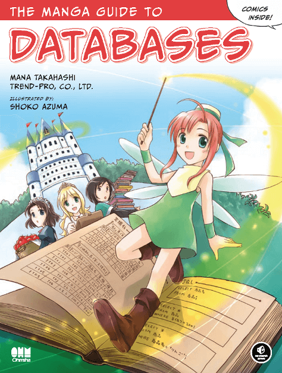
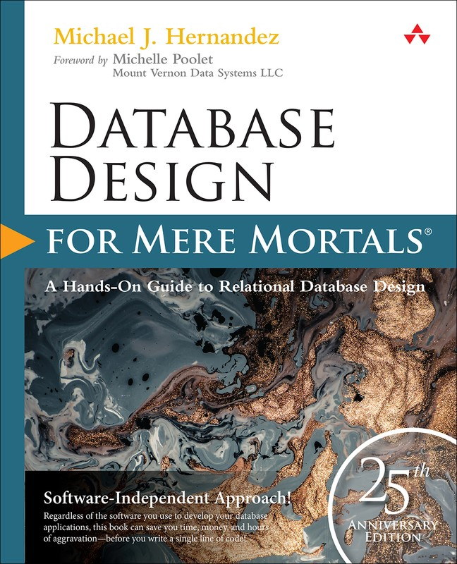
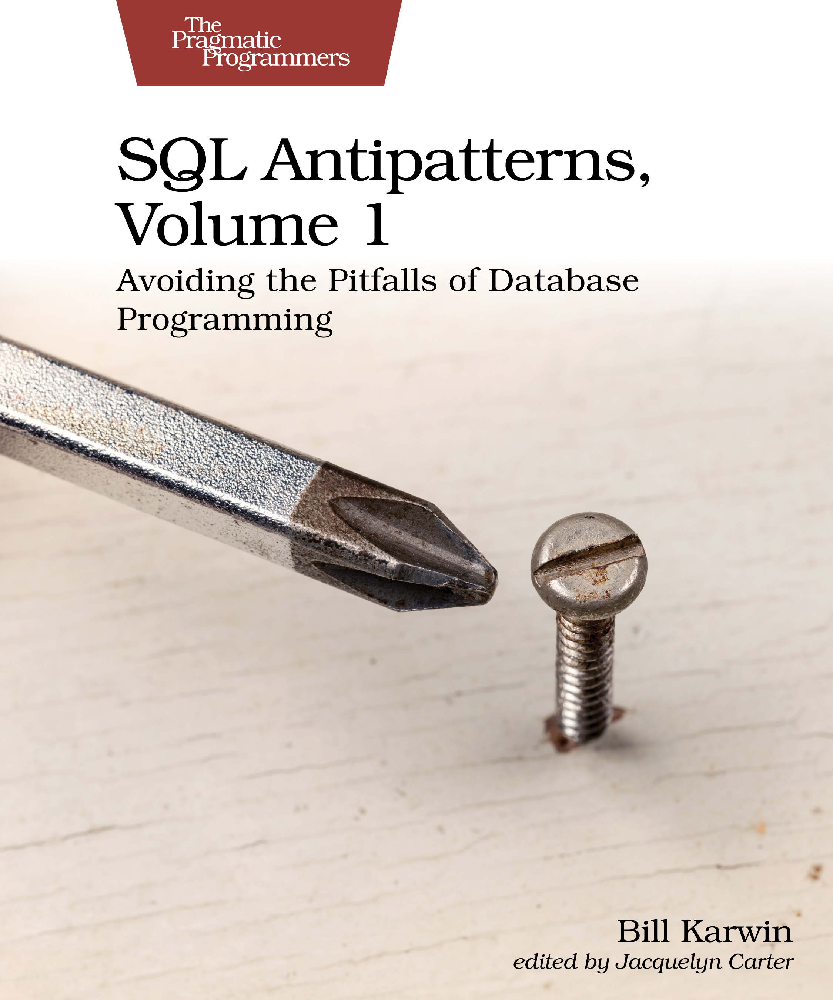
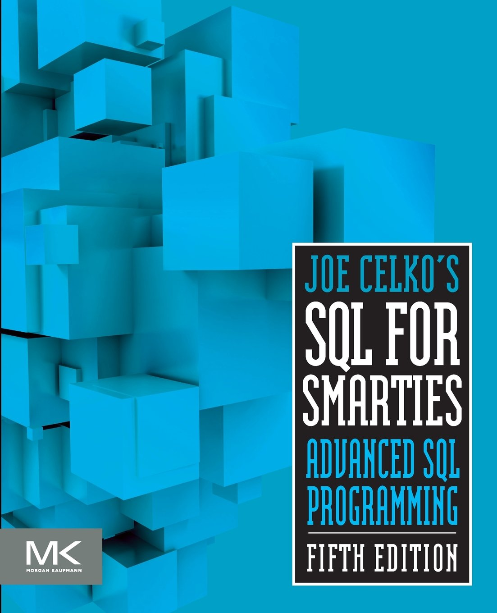
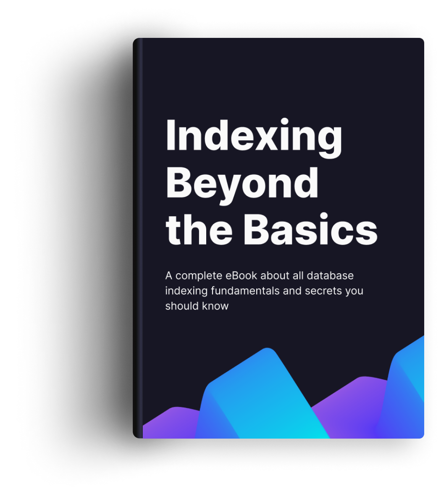
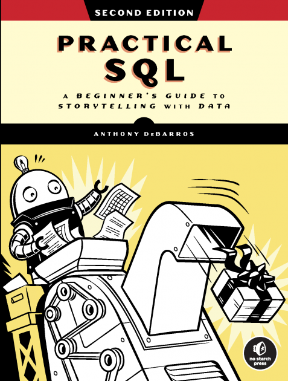
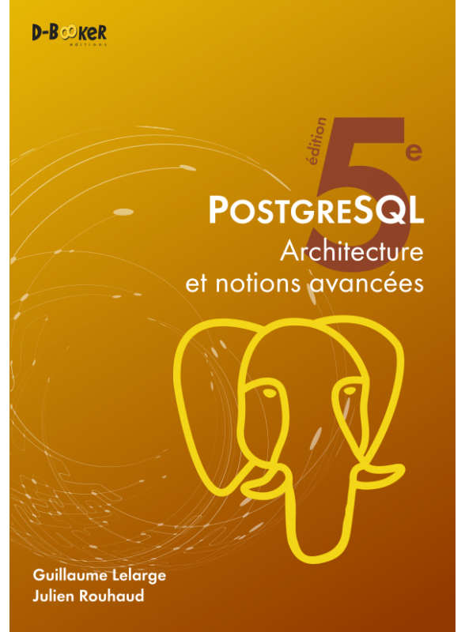
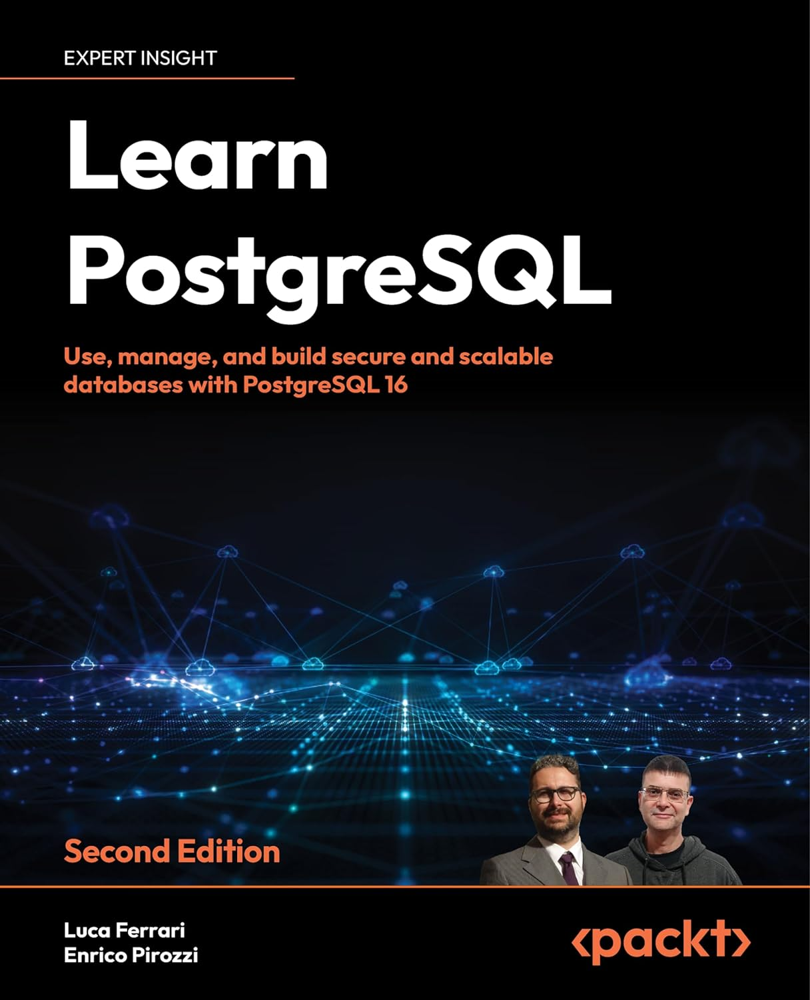

{}

I'm only going to list a few books, but I could list lots more :smiley:. I hope it will help more developers, DBAs, DEVOPS, CTOs ... to understand databases and their challenges better.

# Database fundamentals

## The Manga Guide to Databases

Level : Beginner

[The Manga Guide to Databases](https://nostarch.com/mg_databases.htm) is the one I recommend for most in my audits.

It's really great, easy to read, and yet it doesn't do compromise between simplicity and content.

It covers all the important subjects:

* Design
* Writing simple queries
* Key database concepts: transaction, isolation...

## Database Design for Mere Mortals

Level : Medium

[Database Design for Mere Mortals](https://www.informit.com/store/database-design-for-mere-mortals-25th-anniversary-edition-9780136788041) by *Michael J. Hernandez* is, as its name suggests, focused on design.

It's a hefty 600-plus pages, but don't let that fool you. It reads very well, it's well explained in simple terms and the author has taken care to avoid getting bogged down in theory, which can sometimes be overwhelming.

I really liked the interview process used to build the data model, and the emphasis placed on documenting the model. He doesn't talk much about normal forms, which is a matter. However, if you follow his process, the model respects normal forms.

## SQL Antipatterns

[SQL Antipatterns](https://pragprog.com/titles/bksap1/sql-antipatterns-volume-1/) is a good book to spot *anti-patterns* and suggest solutions.
I use it often when I need to explain what's wrong with a model or a query.

## SQL for Smarties

Level : Advanced

It's hard not to mention [Joe Celko](https://en.wikipedia.org/wiki/Joe_Celko)'s books. He contributed to the SQL standard and has written [many books](https://www.oreilly.com/pub/au/1919).

[SQL for Smarties](https://www.sciencedirect.com/book/9780128007617/joe-celkos-sql-for-smarties) is one of the leading references on SQL. The first edition dates back to 1995... yes... almost 30 years as I write this! The fifth edition was published in 2015, and despite these 10 years, the content is still relevant. There are even some fairly recent commands, such as ``LATERAL``, ``window functions`` and ``CTE``.

At over 800 pages, the book is very exhaustive. I'd say reserved for those who really want to deepen their knowledge of SQL.

## The Art Of SQL

Level : Advanced

[Stephane Faroult](https://www.oreilly.com/pub/au/2005)'s [The Art of SQL](https://www.oreilly.com/library/view/the-art-of/0596008945/) takes us into a new category. This is more advanced SQL. The book will focus on performance and best practices. Despite being 18 years old, its content is still relevant today. It's a very powerful book, and you'll need time to read it and absorb every page.

# Performance

## SQL Performance Explained

Level : Medium

It's impossible not to include the excellent book by [Markus Winand](https://winand.at/), [SQL Performance Explained](https://sql-performance-explained.com).

As the title suggests, we'll be focusing on performance, indexing and queries. It has also been translated into several languages: German, Spanish, Japanese and French, thanks to Guillaume Lelarge SQL : [SQL : Au cœur des performances](https://sql-au-coeur-des-performances.fr/).

The contents of the book are also available on his website,  [Use the Index, Luke !](https://use-the-index-luke.com/) Markus is also the author of an excellent site on advanced SQL features: [Modern SQL](https://modern-sql.com/). During the [Modern SQL show on Postgres.FM](https://youtu.be/mGqqQg-dG-w?si=he4R6eTC_2VckAVA), he announced his intention to make a book out of it. I can't wait! He has also given many [presentations](https://winand.at/sql-slides-for-developers).

## Indexing Beyond the Basics

Level : Beginner - Medium

[Indexing Beyond the Basics](https://sqlfordevs.com/ebooks/indexing) is an e-book focusing on indexes. An interesting point is that it also mentions why Postgres doesn't use an index.

# PostgreSQL

## Practical SQL

Level : Beginner - medium

[Practical SQL](https://nostarch.com/practical-sql-2nd-edition/) is a great book for someone new to Postgres. It covers everything from SQL to advanced datatypes. How to use SQL for data analysis, *full text search*, administration operations...

## PostgreSQL - Architecture et notions avancées

Level : Medium - avancé

[PostgreSQL - Architecture et notions avancées](https://www.d-booker.fr/bases-de-donnees/805-1338-postgresql-architecture-et-notions-avancees-5ed.html#/21-option-consultation_en_ligne)
by Guillaume Lelarge and Julien Rouhaud is **the** book I recommend for anyone wanting to understand how Postgres works. My only regret is that it hasn't been translated into English.

It's also worth noting that it's updated every year.

## Learn PostgreSQL

[Learn PostgreSQL](https://www.packtpub.com/product/learn-postgresql-second-edition/9781837635641) by Lucas Ferrari and Enrico Pirozzi is a complete book on Postgres administration. A *must have* for a DBA.

## PostgreSQL 14 Internals

[PostgreSQL 14 Internals](https://postgrespro.com/community/books/internals) by Egor Rogov. It's very complete. Many thanks to him for making it freely available.

In the same kind, there's a site [The Internals of PostgreSQL](https://www.interdb.jp/pg/) by Hironobu SUZUKI.

