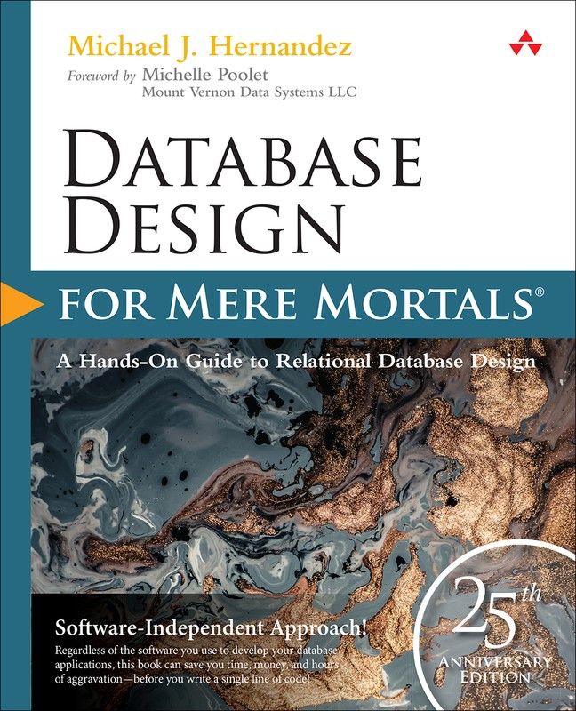
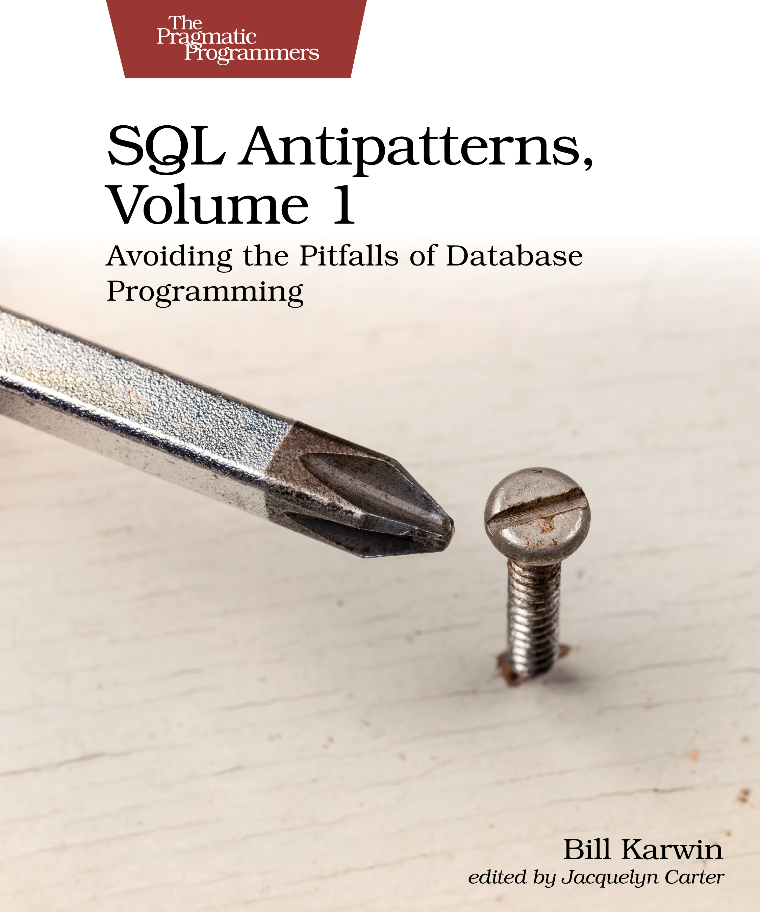
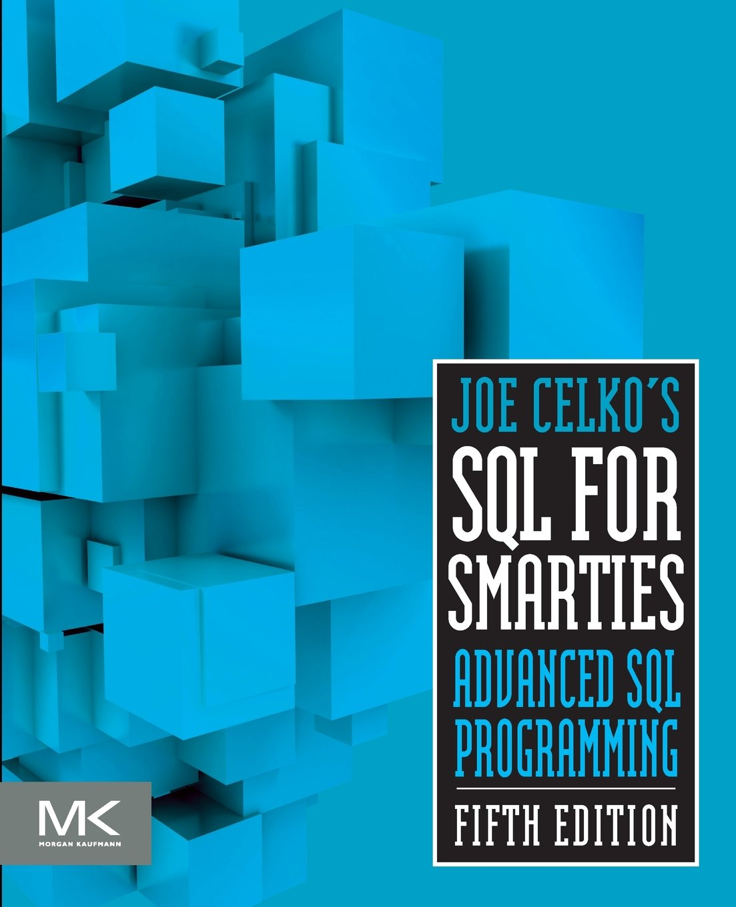
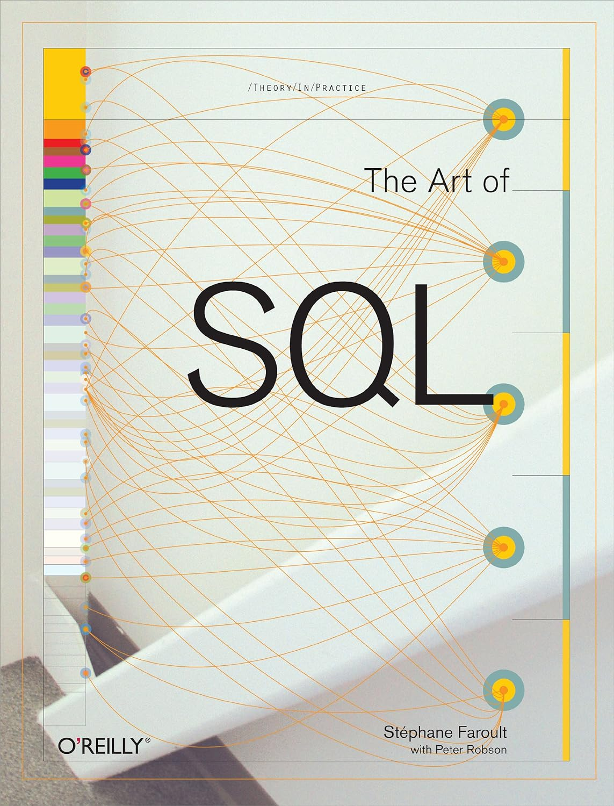
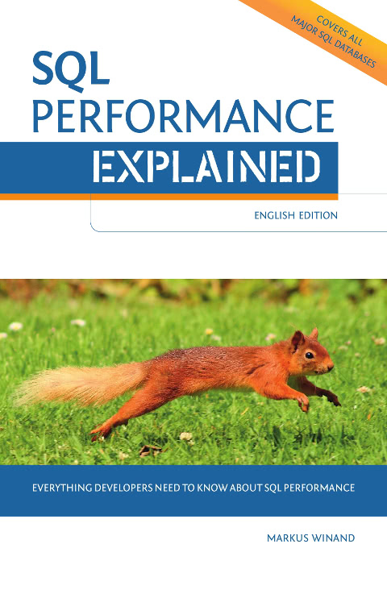
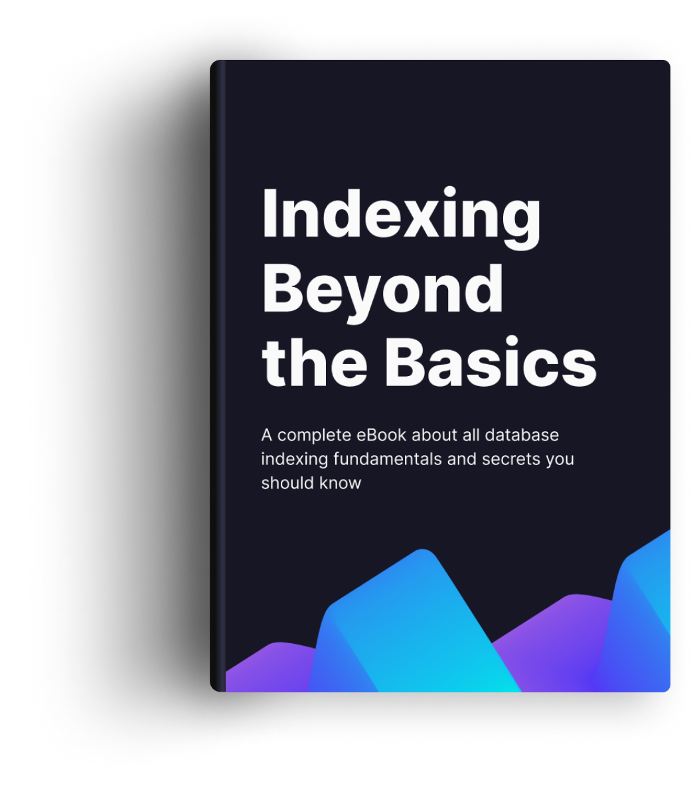
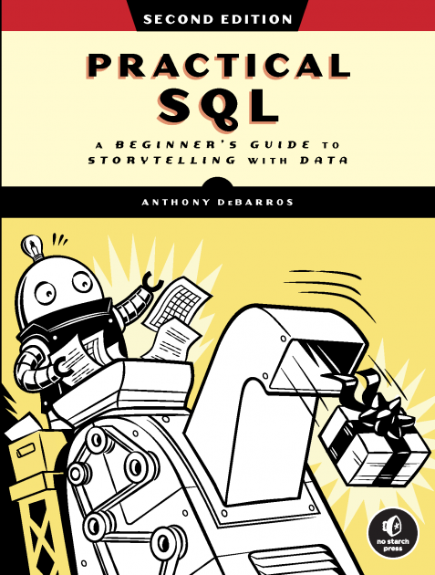
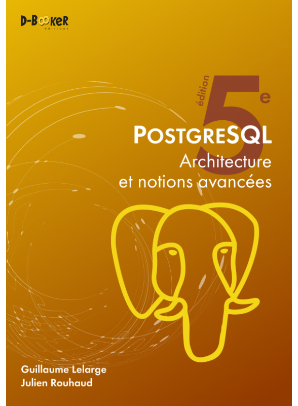
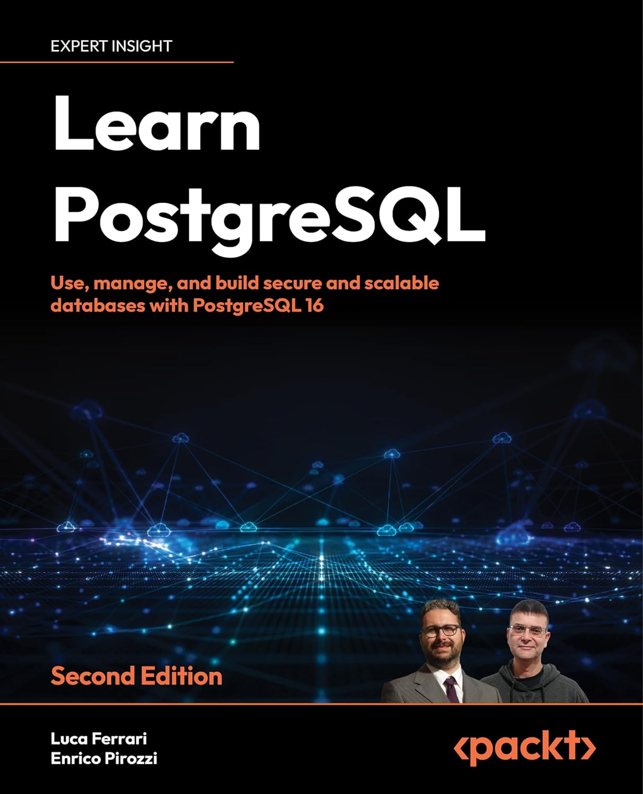
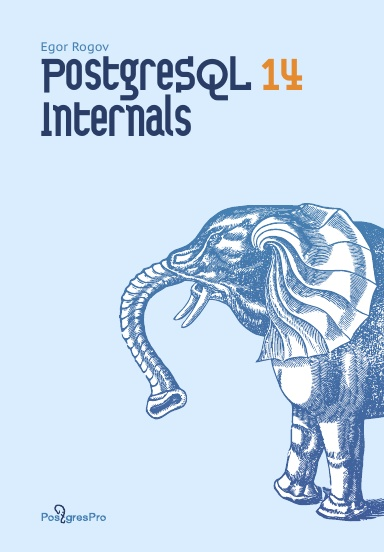

{}

Je ne vais lister que quelques livres, mais je pourrais en citer pleins d'autres :smiley: . J'espère que ça permettra à plus de développeurs, DBA, DEVOPS, CTO ... de mieux comprendre les bases de données et leurs enjeux.

# Fondamentaux des bases de données

## The Manga Guide to Databases

Niveau : Débutant

[The Manga Guide to Databases](https://nostarch.com/mg_databases.htm) est celui que je recommande dans la plupart de mes rapports d'audit.

Il est vraiment génial, facile à lire et pour autant, il ne sacrifie pas le fond à la forme.

Il couvre un peu tous les aspects importants :

* Modélisation
* Écriture de requêtes simples
* Grands principes des bases de données : transaction, isolation...

## Database Design for Mere Mortals

Niveau : Intermédiaire

[Database Design for Mere Mortals](https://www.informit.com/store/database-design-for-mere-mortals-25th-anniversary-edition-9780136788041) de *Michael J. Hernandez* est, comme son nom l'indique, orienté sur la modélisation.

C'est un gros pavé de plus de 600 pages, mais il ne faut pas se laisser impressionner. Il se lit très bien, c'est bien vulgarisé et l'auteur a fait attention  à éviter de s'embarquer dans la théorie qui peut parfois être indigeste.

J'ai beaucoup aimé le processus d'interviews pour construire le modèle de données, l'accent mis sur la documentation du modèle. Il  parle peu des formes normales, c'est un parti pris. Cependant, si on suit son processus, le modèle respecte bien les formes normales.

## SQL Antipatterns

[SQL Antipatterns](https://pragprog.com/titles/bksap1/sql-antipatterns-volume-1/) est un bon livre pour identifier les *anti-patterns* et apporte des solutions.
Je m'en sers régulièrement quand j'ai besoin d'expliquer ce qui ne va pas dans un modèle ou une requête.

## SQL for Smarties

Niveau : Avancé

Comment ne pas mentionner les livres de [Joe Celko](https://en.wikipedia.org/wiki/Joe_Celko).
Il a participé au standard SQL et écrit de [nombreux livres](https://www.oreilly.com/pub/au/1919).

[SQL for Smarties](https://www.sciencedirect.com/book/9780128007617/joe-celkos-sql-for-smarties) fait partie
des références en matière de SQL. La première édition date de 1995... oui... presque 30 ans quand j'écris ces lignes !
La cinquième édition date de 2015, malgré ces 10 ans, le contenu est toujours d'actualité. On trouve même des ordres assez récents comme ``LATERAL``, les *window functions*, ``CTE``.

On est aussi sur un gros pavé de plus de 800 pages, le livre est très complet, assez exhaustif. Je dirai réservé à ceux qui veulent vraiment approfondir leurs connaissances en SQL.

À noter qu'il existe une version en français basé sur la seconde édition qui date de 2000, elle accuse un peu l'age : [SQL Avancé](https://www.decitre.fr/livres/sql-avance-9782711786367.html). On peut le trouver [d'occasion](https://www.momox-shop.fr/joe-celko-sql-avance-taschenbuch-M02841801411.html).

## The Art Of SQL

Niveau : Avancé

Avec [The Art of SQL](https://www.oreilly.com/library/view/the-art-of/0596008945/) de [Stephane Faroult](https://www.oreilly.com/pub/au/2005), on change de catégorie. Là, on est sur du SQL plus avancé.
Le livre va être orienté performances, bonnes pratiques. Malgré ses 18 ans, son contenu est toujours d'actualité. C'est un livre très puissant, il vous faudra du temps pour le lire et assimiler chaque page.

# Performance

## SQL Performance Explained

Niveau : Intermédiaire

Impossible de ne pas mentionner l'excellent livre de [Markus Winand](https://winand.at/), [SQL Performance Explained](https://sql-performance-explained.com).

Comme son titre l'indique, on va parler performance, indexation, écriture de requêtes. À noter qu'il a également été traduit en plusieurs langues : Allemand, Espagnol, Japonais et Français grâce à Guillaume Lelarge [SQL : Au cœur des performances](https://sql-au-coeur-des-performances.fr/).

Le contenu du livre est également disponible sur son site [Use the Index, Luke !](https://use-the-index-luke.com/). Markus est aussi l'auteur d'un excellent site sur les fonctionnalités avancés du SQL : [Modern SQL](https://modern-sql.com/). Lors de l'émission [Modern SQL sur Postgres.FM](https://youtu.be/mGqqQg-dG-w?si=he4R6eTC_2VckAVA), il a annoncé la volonté d'en faire un livre. J'ai hâte ! Il a aussi fait de nombreuses [présentations](https://winand.at/sql-slides-for-developers).

## Indexing Beyond the Basics

Niveau : Débutant - Intermédiaire

[Indexing Beyond the Basics](https://sqlfordevs.com/ebooks/indexing) est un e-book orienté sur les index. Un point intéressant est qu'il mentionne aussi pourquoi le moteur n'utilise pas un index.

# PostgreSQL

## Practical SQL

Niveau : Débutant - intermédiaire

[Practical SQL](https://nostarch.com/practical-sql-2nd-edition/) est un super livre pour quelqu'un qui débute sur Postgres. Il parle d'un peu de tout, du SQL jusqu'aux types avancés. Comment utiliser le SQL pour analyser des données, faire du *full text search*, opération d'administration...

## PostgreSQL - Architecture et notions avancées

Niveau : Intermédiaire - avancé

[PostgreSQL - Architecture et notions avancées](https://www.d-booker.fr/bases-de-donnees/805-1338-postgresql-architecture-et-notions-avancees-5ed.html#/21-option-consultation_en_ligne) par Guillaume Lelarge et Julien Rouhaud est **le** livre que je recommande pour qui veut comprendre comment fonctionne Postgres. Mon seul regret est qu'il ne soit pas traduit en anglais pour en faire profiter plus de lecteurs.

À noter aussi qu'il est mis à jour tous les ans.

## Learn PostgreSQL

[Learn PostgreSQL](https://www.packtpub.com/product/learn-postgresql-second-edition/9781837635641) par Lucas Ferrari et Enrico Pirozzi est un livre très complet sur l'administration de Postgres. Un *must have* pour un DBA.

Pour les francophones, vous pouvez vous orienter vers [PostgreSQL Administration et exploitation de vos bases de données](https://www.editions-eni.fr/livre/postgresql-administration-et-exploitation-de-vos-bases-de-donnees-4e-edition-9782409011467) de Sébastien Lardière.

## PostgreSQL 14 Internals

[PostgreSQL 14 Internals](https://postgrespro.com/community/books/internals) par Egor Rogov est un livre sur les entrailles de Postgres. Il est vraiment très complet. Un grand merci à lui de le mettre à disposition en accès libre.

Dans le même style, il existe un site [The Internals of PostgreSQL](https://www.interdb.jp/pg/) par Hironobu SUZUKI.

