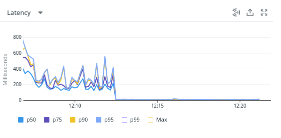
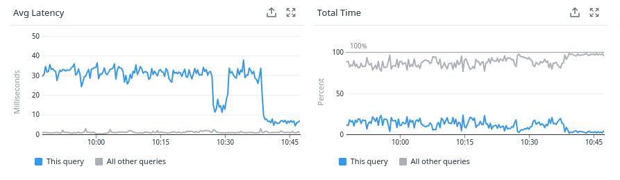
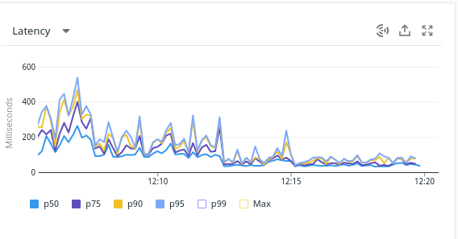
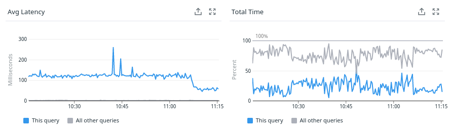
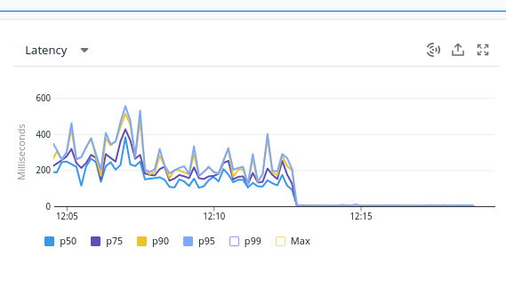

The mission consisted in auditing PostgreSQL instances on the Heroku cloud in order to identify performance problems.

In the process, I helped set up a monitoring system and take advantage of Datadog's dashboards and APM. Some optimizations enabled us to halve response times across the entire website.

I was later asked to help them understand partitioning in Postgres.

Here's what *Lucas Tiné-Berès (Foodles' CTO)* had to say:

> Adrien is a great professional. He was able to correctly identify the performance problems of our database and propose appropriate corrective measures.
>
> Adrien was able to adapt to our cloud provider, which didn't provide an ideal working environment, and helped us set up our monitoring tool via Datadog.
>
> Thanks to him, we've been able to halve our p95 and are much more confident about managing our databases.
>
> Last but not least, beyond his technical skills, Adrien's explanations always include details of how the engine works, and his explanations, both verbally and in his report, are extremely clear.
>
> I recommend Adrien 100% and would be delighted to use his services again.

