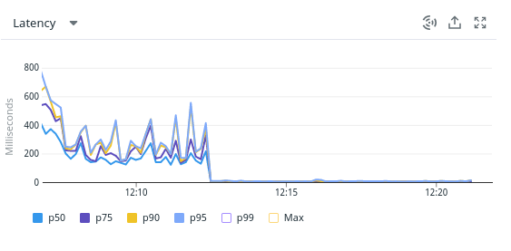
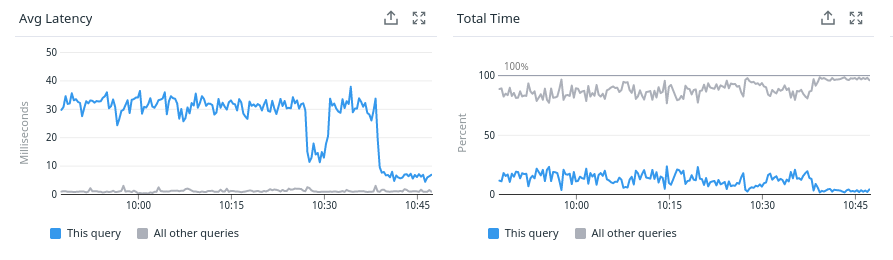
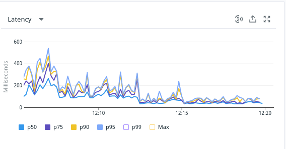

La mission a consisté à faire un audit des instances PostgreSQL sur le cloud Heroku afin d'identifier les problèmes de performances.

Au passage, j'ai aidé à mettre en place un système de monitoring et tirer parti des tableaux de bord de Datadog et son APM. Certaines optimisations ont permis de diviser par deux les temps de réponses sur la totalité du site.

J'ai été sollicité plus tard pour les aider à comprendre le partitionnement dans Postgres.

Voici le retour de *Lucas Tiné-Berès (CTO de Foodles)* :

> Adrien est un très grand professionnel. Il a pu correctement identifier les problèmes de performances de notre base de donnée et nous proposer des correctifs adéquats.
>
> Adrien a su s'adapter à notre cloud provider qui ne fournissait pas un environnement de travail idéal et nous a aidé à mettre en place notre outil de monitoring via Datadog.
>
> Grâce à lui nous avons pu diviser par deux notre p95 et nous sommes beaucoup plus serein dans la gestion de nos bases de données.
>
> Enfin au delà de ses compétences techniques Adrien distille toujours dans ses explications des détails sur le fonctionnement du moteur et ses explications que ce soit à l'oral ou dans son rapport sont extrêmement claires.
>
> Je recommande Adrien à 100% et aurait plaisir à faire de nouveau appel à ses services.

