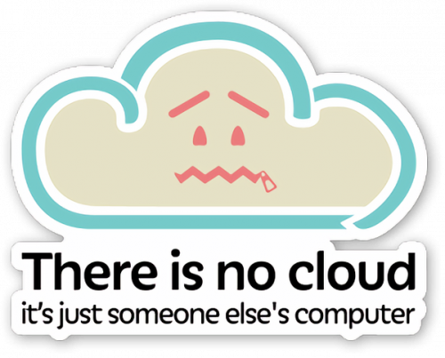
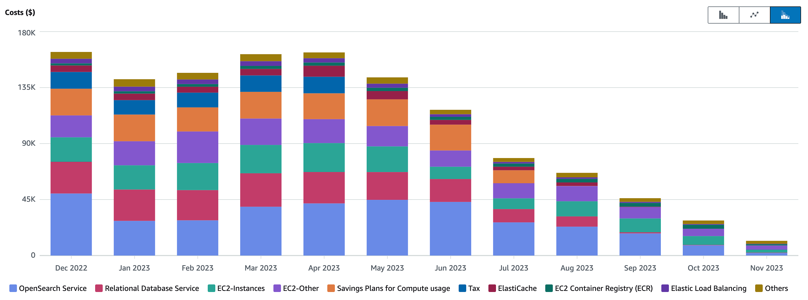

{}

# There is no cloud. It’s just someone else’s computer

Even if I've followed the cloud trend, I've always wanted to keep one foot in the infrastructure and the system[^1].

[^1]: The page you're reading is hosted on my server. I manage my little server (HTTPS, reverse proxy, backups...).

I think it's essential to maintain this kind of knowledge to understand performance challenges.

Today, this allows me to build complete infrastructures for customers for different reasons:

* Large public sector organizations that already have a physical infrastructure and don't want to depend on a cloud provider.
* Performance: dedicated servers with local storage are much more efficient than cloud instances.
* Economical: when the infrastructure becomes large, the cloud can be very expensive.

Since 2023, I've noticed a change of heart about the cloud, and obviously I'm not the only one:

* [CIOs revisit their 100% cloud strategies](https://www.cio-online.com/actualites/lire-les-dsi-reviennent-sur-leurs-strategies-100-cloud-15499.html) - *01 Mars 2024*
  *"Moving away from the cloud was a major theme in 2023, and is likely to become a real trend in 2024. The cost savings are simply too great for many companies to ignore."*
* [FinOps: mindsets change, budget overspending remains](https://www.cio-online.com/actualites/lire-les-dsi-reviennent-sur-leurs-strategies-100-cloud-15499.html) - *17 Avril 2024*
   *"7 out of 10 companies are still unable to meet their cloud budgets, due to a lack of visibility and an inability to integrate cost control into upstream project phases"*

David Heinemeier Hansson, creator of the Ruby On Rails framework, has written many articles on this subject:

* [Why we're leaving the cloud](https://world.hey.com/dhh/why-we-re-leaving-the-cloud-654b47e0)
* [Our cloud exit has already yielded $1m/year in savings](https://world.hey.com/dhh/our-cloud-exit-has-already-yielded-1m-year-in-savings-db358dea)
* [The Big Cloud Exit FAQ](https://world.hey.com/dhh/the-big-cloud-exit-faq-20274010)
* [We have left the cloud ](https://world.hey.com/dhh/we-have-left-the-cloud-251760fb)
* [Cloud exit pays off in performance too](https://world.hey.com/dhh/cloud-exit-pays-off-in-performance-too-4c53b697)
* [Five values guiding our cloud exit](https://world.hey.com/dhh/five-values-guiding-our-cloud-exit-638add47)
* [Hardware is fun again](https://world.hey.com/dhh/hardware-is-fun-again-b819d0b4)
* [We stand to save $7m over five years from our cloud exit](https://world.hey.com/dhh/we-stand-to-save-7m-over-five-years-from-our-cloud-exit-53996caa)
* [The hardware we need for our cloud exit has arrived](https://world.hey.com/dhh/the-hardware-we-need-for-our-cloud-exit-has-arrived-99d66966)

TL;DR :

* They have deployed several physical servers on two separate sites (4000 vCPUs, 7680GB RAM, and 384TB NVMe storage).
* They will save ~~7 million~~ 10 **million** dollars over 5 years.
* The hardware purchase paid for itself in 6 months.
* Performance is much better.

# Architecture example

Here is an example of the architecture I created for a customer:

* 1 primary and 5 replicas: 2 synchronous, 2 asynchronous cascaded
* Postgres server:
  * AMD EPYC 9354 32-Core / 64 threads
  * 512GB DDR5 RAM
  * 5.5TB NVMe storage (several **million** IOPS)
  * 25 Gb/s network
* “Local” backup :
  * Point In Time Recovery
  * AMD EPYC 9124 16-Core
  * 128GB DDR5
  * 15TB of NVMe storage
  * 25 Gb/s network
* External backup on S3 equivalent
* Cost: approx. €4,000/month ex VAT vs. over $300,000/month on AWS RDS. Performance is even better thanks to storage.
* Backup time for a 1TB database: less than 5 minutes for a full backup, a few seconds for a differential backup.
* Restore time 5 minutes.
* Linux tuning: RAID, Kernel...
* Postgres tuning
* Drafting of installation, backup/restore and failover procedures...

Of course, I've also built more simple architectures:

* On virtual machines
* With a connection pooler (PgBouncer)
* Supervision support: Datadog, Nagios like (Icinga, Thruk) with [check_pgactivity](https://github.com/OPMDG/check_pgactivity).
